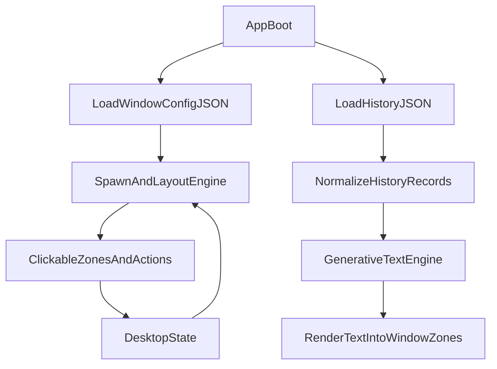

# Material Desktop Iteration Plan

## Goal

Create a scalable desktop interaction system where each PNG window has its own config (size, clickable zones, text-art zones, behavior), windows can open anywhere, and generative behavior can be driven by your exported Chrome history.

## Iteration 1 (Balanced Vertical Slice)

- Introduce a central asset-config JSON file to define each of the 21 PNG windows:
  - relative size and optional spawn constraints
  - clickable zones (close, spawn, navigate, mode-change)
  - generative text zones (0..n per asset)
  - role flag (`interactive` vs `decorative`)
- Replace current offset-style spawning with viewport-safe random placement logic so new windows can appear across the full desktop area.
- Add a lightweight bottom desktop bar component (placeholder styling), including a reset action.
- Add a browser-history ingestion module that reads your exported JSON first and normalizes data into a common internal shape designed to later support direct Chrome SQLite ingestion.
- Connect one initial generative text mode to normalized history data and render text into configured text zones for selected assets.

## Proposed Data Model

- `assets/windows.config.json`
  - per-window record keyed by asset id/path
  - fields: `size`, `spawnRules`, `clickZones`, `textZones`, `role`, `actions`
- `shared/data/history.schema.json` (or JS typedefs)
  - normalized fields: timestamp, domain, title, url, visitCount, typedCount
- Runtime flow:

## File-Level Implementation Plan

- Update `[/Users/erinlivingston/Desktop/materialdesktop/shared/js/overlay.js](/Users/erinlivingston/Desktop/materialdesktop/shared/js/overlay.js)`
  - split into modules/functions: config load, spawn engine, window rendering, action dispatch, history normalization hook.
- Add `[/Users/erinlivingston/Desktop/materialdesktop/assets/windows.config.json](/Users/erinlivingston/Desktop/materialdesktop/assets/windows.config.json)`
  - canonical source for per-asset sizing and zones.
- Add `[/Users/erinlivingston/Desktop/materialdesktop/shared/js/history-data.js](/Users/erinlivingston/Desktop/materialdesktop/shared/js/history-data.js)`
  - parse JSON export + normalize schema.
- Add/adjust `[/Users/erinlivingston/Desktop/materialdesktop/shared/css/common.css](/Users/erinlivingston/Desktop/materialdesktop/shared/css/common.css)`
  - bottom bar styles, zone-debug overlay class (optional toggle), window placement constraints.
- Update `[/Users/erinlivingston/Desktop/materialdesktop/desktop/index.html](/Users/erinlivingston/Desktop/materialdesktop/desktop/index.html)`
  - include bottom bar/reset UI and any new layer containers for zone rendering.

## Iteration 2

- Build a zone-mapping helper mode (debug overlay) to help you visually tune exact clickable/text coordinates per PNG.
- Add support for additional action types: open project-info pages, alter generative mode, open themed window groups.
- Improve collision/stack behavior (optional snapping or anti-overlap weighting).

## Iteration 3

- Add optional Chrome SQLite ingestion path behind a separate adapter while keeping normalized schema unchanged.
- Expand generative text behaviors driven by history segments (time windows, domain clusters, category groupings).
- Integrate final desktop background asset and refine bottom bar interaction design.

## Defaults Locked From Your Answers

- Iteration 1 is a balanced slice (layout + history + text zones).
- History pipeline starts with JSON export and is structured to support SQLite next.

