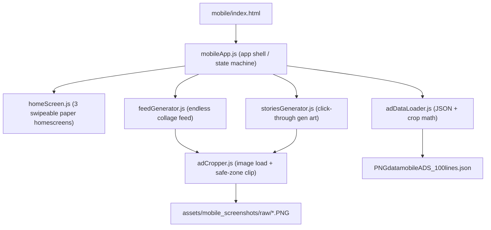
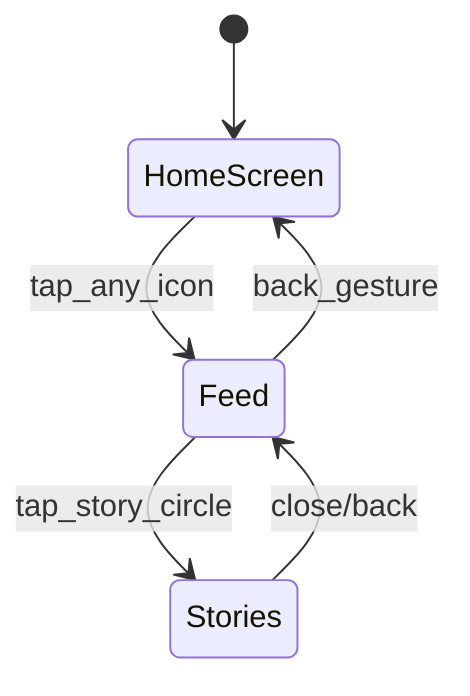

# Mobile Generative Ad Feed Prototype

## Architecture Overview

The mobile view (`mobile/index.html`) currently only loads a background image and returns early in `overlay.js`. We will build a new mobile-specific JS module (`shared/js/mobileApp.js`) that powers a multi-screen app shell, plus dedicated generative art engines for each "page."

## Data Layer

**File: `shared/js/adDataLoader.js`**

- Fetch and parse [PNGdatamobileADS_100lines.json](assets/mobile_screenshots/meta/PNGdatamobileADS_100lines.json)
- Group items by `insta_location`: `feed` (51 items), `story` (20 items), `reel` (29 items)
- For each item, compute a `safeCropRect` in pixels:
  - Top edge: `130px` (top bar height) + `200px` buffer if `non_adcontent_undertopbar` is true
  - Bottom edge: image height minus `275px` (bottom bar) minus `200px` buffer if `non_adcontent_abovebottombar` is true
  - This gives us the clean ad-content-only region per screenshot
- Export helpers: `getRandomItems(location, count)`, `getAllKeywords()`, `getAllEmotions()`

## Image Cropping Engine

**File: `shared/js/adCropper.js`**

- Load PNG into an offscreen `<canvas>` via `Image()` + `drawImage()`
- Crop to the computed `safeCropRect` to get the ad-only region
- Extract random rectangular sub-clips from within the safe zone for collage fragments (variable sizes: 80-400px wide)
- Cache loaded/cropped images in a `Map` to avoid redundant loads
- Export: `loadAndCropAd(item)` returns a canvas with the cropped ad region, `extractFragment(item, width, height)` returns a random rectangular clip

## Generative Feed (Primary Focus)

**File: `shared/js/feedGenerator.js`**

The endless feed is a full-viewport `<canvas>` that auto-scrolls and composites collage fragments. Design:

- **Scroll mechanism**: A virtual Y offset that increments slowly (~0.3px/frame). Touch/swipe can speed it up or slow it down but never stop it entirely (the "slog" feeling).
- **Fragment spawning**: As the scroll reveals new vertical space at the bottom, spawn new collage fragments at random X positions. Each fragment is a cropped rectangular clip from a random ad image.
- **Compositing effects**:
  - Vary `globalAlpha` (0.15 - 0.85) per fragment for the transparent/layered look
  - Use `globalCompositeOperation` modes (`multiply`, `screen`, `overlay`) to blend fragments
  - Color tinting: apply semi-transparent color washes derived from each ad's keyword associations (e.g., "cozy" = warm amber, "adventure" = cool blue-green)
  - **Heat map overlay**: A radial gradient layer that pulses slowly, using warm-to-cool color stops, rendered on top with `globalCompositeOperation: 'overlay'` at low alpha. This creates the transparent heat-map-like visual.
- **Text drift**: Occasionally render `adtext` or `keywords` from the metadata as faded text that scrolls with the collage, reinforcing the ad saturation theme.
- **Recycling**: Fragments that scroll past the top of the viewport are discarded; a rolling buffer of ~30-50 visible fragments keeps memory stable.

**Story profile circles**: 3-4 circular icons rendered at the top of the feed (fixed position, not scrolling). Each is a tiny circular crop from a random ad. Tapping any circle navigates to the stories view.

## Stories View

**File: `shared/js/storiesGenerator.js`**

- Full-screen static generative compositions, one at a time
- Each "story" is a canvas composition: a large cropped ad fragment as background, with overlaid smaller fragments, color washes, and text
- **Click-through**: Tap left half = previous, tap right half = next. Each tap regenerates the composition from a different random ad (no two views are the same)
- **Text buttons**: Overlay 1-2 text elements pulled from the current ad's `emotionorsense` and `keywords` fields, styled as tappable "shop" / "swipe up" prompts (these are non-functional parodies, consistent with the art concept)
- A progress bar at top (like IG stories) shows position in a set of ~10 generated slides
- Tap-and-hold pauses on a frame, release advances

## Home Screens

**File: `shared/js/homeScreen.js`**

- 3 swipeable/tappable paper-textured phone home screen views
- Each is a `<canvas>` drawing:
  - Paper-like background: off-white with subtle noise texture (generated procedurally via pixel manipulation)
  - Grid of ~16-20 rounded-rectangle "app icons" as simple colored shapes with 1-2 letter labels
  - One icon is visually emphasized as the "Instagram" knock-off (slightly larger, or with a camera-like glyph)
  - A faux dock at the bottom with 4 icons
- Swipe left/right to cycle between the 3 home screens (dot indicators at bottom)
- **Any tap on any icon** navigates to the feed view
- The 3 screens vary only in icon color palette and arrangement

## App Shell & Navigation

**File: `shared/js/mobileApp.js`**

State machine with screens:

- Manages which screen is active, handles transitions (simple crossfade)
- Renders into a single container div inside `mobile/index.html`
- Touch gesture: swipe down from top edge = back to previous screen

## File Changes Summary

- **Edit**: [mobile/index.html](mobile/index.html) -- restructure for the app shell (remove canvas/hud, add app container)
- **Edit**: [shared/css/common.css](shared/css/common.css) -- add mobile-specific styles (prefixed with `.viewport--mobile`)
- **New**: `shared/js/mobileApp.js` -- app shell, state machine, screen transitions
- **New**: `shared/js/homeScreen.js` -- 3 paper-textured home screen canvases
- **New**: `shared/js/feedGenerator.js` -- endless generative collage feed
- **New**: `shared/js/storiesGenerator.js` -- click-through generative story slides
- **New**: `shared/js/adDataLoader.js` -- JSON loader, grouping, crop-rect math
- **New**: `shared/js/adCropper.js` -- image loading, safe-zone cropping, fragment extraction
- No changes to desktop functionality or `overlay.js`

## Prototype Scope / What Gets Deferred

- **Reels view**: Deferred to a later iteration. The data is grouped and ready (`insta_location: "reel"`, 29 items) but no UI yet.
- **Per-image crop refinement**: Using generous fixed buffer for now; metadata can be extended with exact crop coordinates later.
- **Performance tuning**: The prototype will lazy-load images (5-10 at a time) and recycle off-screen fragments. Further optimization (web workers, offscreen canvas) can come later if needed.
