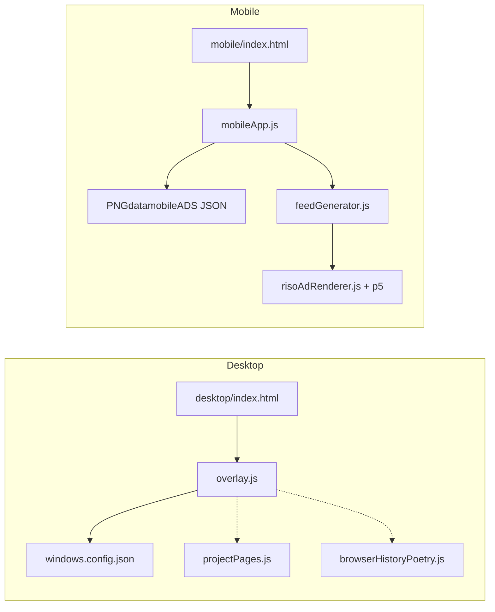

# Runtime optimization opportunities (Material Desktop)

## Architecture snapshot

No bundler: browsers load ES modules directly. That keeps the build simple but skips minification, dead-code elimination, and explicit chunk boundaries beyond your existing `import()`.

---

## High impact (CPU / perceived performance)

### 1. Feed fragment pipeline is strictly sequential

In `[shared/js/feedGenerator.js](shared/js/feedGenerator.js)`, `spawnFragments` loops with `await` inside the `for` body: each item waits for `extractFragment` then `renderRisoAdCanvas` before the next starts. That caps throughput on the main thread and stretches time-to-full-feed.

**Direction:** Process items with a small concurrency pool (e.g. 2–4 parallel workers) or batch: decode/crop in parallel, then riso in parallel with a cap. Watch total memory (each path holds canvases).

### 2. Riso path: pixel copy loop

`[shared/js/risoAdRenderer.js](shared/js/risoAdRenderer.js)` `canvasToP5Image` copies `getImageData` into p5’s `pixels` with a JavaScript `for` loop over every byte. At larger fragment sizes this is a hotspot.

**Direction:** Prefer APIs that avoid a full CPU copy if p5/Riso allows (e.g. smaller `maxDim` is already used; ensure it’s always applied early), or investigate whether p5 can ingest image data more cheaply for your version.

### 3. Feed `requestAnimationFrame` loop never rests

The feed’s `render()` always schedules another frame and auto-scrolls (`SCROLL_SPEED`), so the GPU/CPU do full clears and draws every frame while the feed is visible—even when the tab is in the background unless the browser throttles heavily.

**Direction:** Use the [Page Visibility API](https://developer.mozilla.org/en-US/docs/Web/API/Page_Visibility_API) to `cancelAnimationFrame` when hidden and resume when visible. Optionally reduce work when `touchVelocity === 0` and scroll delta is below a threshold (only if you accept less-smooth auto-scroll).

---

## Medium impact (network / startup)

### 4. Mobile loads ad JSON before any screen

`[shared/js/mobileApp.js](shared/js/mobileApp.js)` `await loadAdData()` runs on every mobile load, then `navigateTo(getInitialScreen())`. Users who only see home/project still pay fetch + JSON parse for `[assets/mobile_screenshots/meta/PNGdatamobileADS_100lines.json](assets/mobile_screenshots/meta/PNGdatamobileADS_100lines.json)` (~58KB today).

**Direction:** Defer `loadAdData()` until `initFeed` / `initStories` (and ensure those paths await it). Home/project stay lighter.

### 5. `cache: "no-store"` on static JSON/assets

`[shared/js/adDataLoader.js](shared/js/adDataLoader.js)`, `[shared/js/browserHistoryPoetry.js](shared/js/browserHistoryPoetry.js)`, and desktop config fetch in `[shared/js/overlay.js](shared/js/overlay.js)` use `fetch(..., { cache: "no-store" })`. That avoids stale data in development but disables normal HTTP caching for repeat visitors and refreshes.

**Direction:** Use default cache or `cache: "force-cache"` with versioned filenames / query strings in production, or gate behavior on hostname / build flag.

### 6. External assets on feed init

`[shared/js/feedGenerator.js](shared/js/feedGenerator.js)` preloads many OpenMoji SVGs from jsDelivr in parallel (`preloadOpenmojiTouchImages`). That adds DNS + TLS + parallel requests on first feed open.

**Direction:** Host a minimal subset under `assets/`, lazy-load on first draw gesture, or reduce count.

### 7. Desktop Flaticon “all” CSS

`[desktop/index.html](desktop/index.html)` pulls `flaticon-uicons .../css/all/all.css` from CDN—often a large stylesheet for a handful of icons.

**Direction:** Self-host a trimmed subset or inline the few glyphs you use.

---

## Lower impact / maintainability (still “how code runs”)

### 8. Large `overlay.js` (~2.3k lines)

Everything for desktop loads as one module. You already dynamically import `[projectPages.js](shared/js/projectPages.js)` and `[browserHistoryPoetry.js](shared/js/browserHistoryPoetry.js)`.

**Direction:** Lazy-load debug-only tooling (`debugZones`, zone editor) behind `DEBUG_ENABLED` so casual users never parse/execute that code path.

### 9. History poetry JSON size (~643KB)

`[browserHistoryPoetry.js](shared/js/browserHistoryPoetry.js)` fetches and sorts the full `[assets/browserhistory_2026-03-03_to_2026-03-12_utc.json](assets/browserhistory_2026-03-03_to_2026-03-12_utc.json)` into `linesCache` on first use. Acceptable as a one-off, but memory and parse time are proportional to file size.

**Direction:** Ship a preprocessed “lines only” JSON, or cap rows at build time.

### 10. Module-level image caches (`[adCropper.js](shared/js/adCropper.js)`)

`_imageCache` / `_cropCache` survive for the SPA session—fine with ~100 catalog items; if the dataset grows, consider eviction or weak references.

---

## Deployment / tooling (not in-repo today)

- **Compression:** Ensure the host serves Brotli/gzip for JSON/CSS/JS.
- **Optional bundler:** Rollup/esbuild could minify and split chunks without changing behavior; only worth it if you care about transfer size and parse time on slow devices.

---

## Suggested priority order

1. Defer mobile ad JSON until feed/stories need it.
2. Parallelize (with cap) `spawnFragments` riso/crop work.
3. Pause feed RAF when document hidden.
4. Relax `no-store` for production static assets.
5. Trim or self-host icon CSS / OpenMoji loading.
6. Riso pixel path / `overlay.js` code-splitting as follow-ups.

No single “wrong” choice here: sequential riso may have been intentional to avoid jank; parallel work needs tuning so the main thread does not stall on GC or decode bursts.